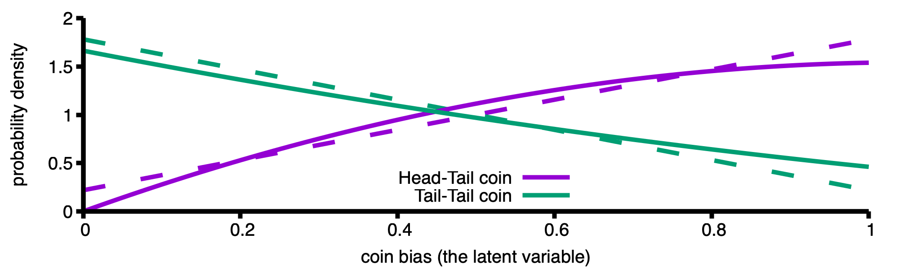

# What the Variational Autoencoder (VAE) Does

Imagine a collection of coins, each with its own bias `z`, drawn
uniformly from `[0, 1]`.  I have a device that scales each bias by a
factor `t` (between `0` and `1`), so the effective bias becomes `z *
t`. I pick two coins, scale their biases, and toss each coin twice:

<pre>
First coin: Tail-Tail
Second coin: Head-Tail
</pre>

The goal is to infer both `t` and the individual biases of the two coins.

Let
<pre>
H = z*t
T = 1 - z*t
</pre>
and define `i(expr)` as the integral of `expr` over `z` from `0` to `1`.

The likelihood of observing the above data is
<pre>
E = i(T*T) * i(H*T)
</pre>

which is a polynomial in `t` with a maximum at `t = 0.473` and two
conditional distributions are weighted guesses for two biases
(quadratic functions of `z`, see the cover image):

<pre>
Q1(z) = T*H/i(T*H)
Q2(z) = T*T/i(T*T)
</pre>

Here, the problem is solved exactly, while the VAE seeks an approximation. Assume linear forms:

<pre>
q1(z) = p*z - (p - 2)/2
q2(z) = -p*z - (p + 2)/2
</pre>

The slopes are linked and the intersects are fixed by
normalization. VAE maximizes evidence lower bound (ELBO) to find
parameters `p` and `t` which is a conditional expectation of
log-likelihoods minus KL-divergence of conditional with
prior. Assuming a uniform prior

<pre>
L1 = i(q1(z)*log(H*T)) + i(q2(z)*log(T*T))
L2 = i(q1(z)*log(q1(z))) + i(q2(z)*log(q2(z)))
L = L1 - L2
</pre>

`L` has a maximum at `t = 0.489` and `p = 1.562`. VAE approximations
and maximum likelihood solutions are in the cover image.  A maximum of
`L = -2.353` is an approximation to `log(E) = -2.330`.

The VAE captures part of the structure of the generative model but not
all of it.  It approximates the likelihood, yet it cannot fully
reproduce the true generative process or accurately compute the
probability of a data point.

- "Tail–Tail" and "Head–Head" represent two data points.
- `z` is the latent variable.
- `t` is the generative model parameter.
- `log(H*T)` and `log(T*T)` form the encoder (the log-likelihoods of
  the observed outcomes, given a latent variable z)
- `q1(z)` and `q2(z)` are the decoder.
- `p` is the recognition model parameter.

P.S. [code](vae.mac)

# References

Kingma, D. P., & Welling, M. (2013). Auto-encoding variational bayes. arXiv preprint arXiv:1312.6114.
