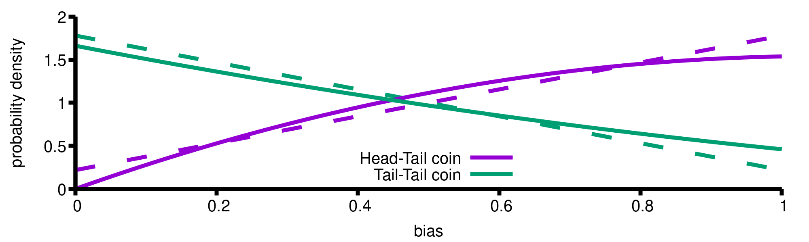

I want to illustrate what variational auctoenocder (VAE) does. Biases
(`z`) of my coins are uniform, and I have a device which scales a bias
to `z * t` (`t` is between `0` and `1`). I pick two coins, scale
biases, and toss two times each.

<pre>
First coin: Tail-Tail
Second coin: Head-Tail
</pre>

I want to guess `t` and biases of two coins. Notation
<pre>
H = z*t
T = 1 - z*t
</pre>
and `i(expr)` is an integral of `expr` over `z` from 0 to 1.

Likelihood
<pre>
E = i(T * T) * i(H * T)
</pre>
is a polynomial of `t` with maximum at `t = 0.473` and two conditional
distributions are weighted guesses for two biases.

<pre>
Q1 = T * H / i(T * H)
Q2 = T * T / i(T * T)
</pre>

VAE approximates those answers. It chooses an expression for two conditionals.
I select linear functions

<pre>
q1(z) = p * z - (p - 2)/2
q2(z) = -p * z - (p + 2)/2
</pre>

Slopes are connected and intersects are fixed by normalization. VAE
maximizes _evidence lower bound_ to find parameters `p` and `t` which
is an expectation of likelihoods minus KL-divergence of conditional
with prior. I choose uniform priors for both coins:

<pre>
L1 = i(q1(z) * log(H * T)) + i(q2(z) * log(T * T))
L2 = i(q1(z) * log(q1(z))) + i(q2(z) * log(q2(z)))
L = L1 - L2
</pre>

`L` has a maximum at `t = 0.489` and `p = 1.562`. VAE approximations
and maximum likelihood solutions are in the cover image. VAE does not
learn enough about generative model to mimic it and to tell the
probabilities of the data points.

P.S. `Tail-Tail` and `Head-Head` are two data points, `z` is a latent
variable, `t` the generative model parameter, `log(H * T)` and `log(T* T)`
is encoder, `q2(z)` and `q1(z)` is decoder, and `p` is
recognition model parameter.

P.S.S. [code](vae.mac)

