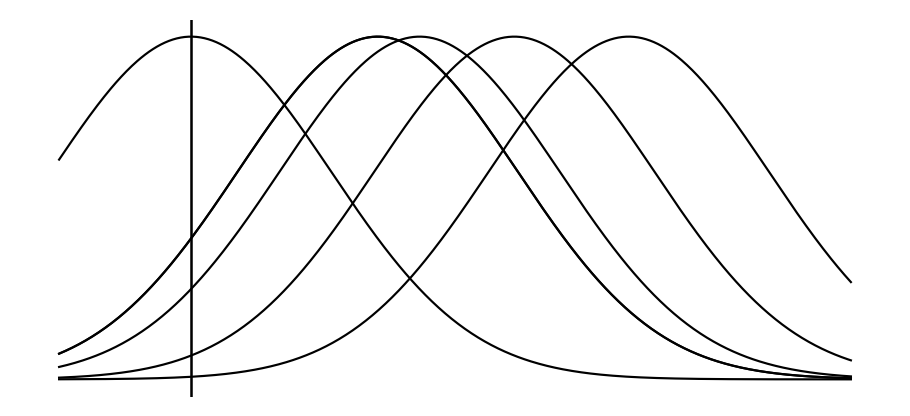

# Attention


A query asks: of a sample that landed on the best-matching key, how likely is it to
have come from each key? Normalized, that's the attention weights.

Take one query `q`. Each key's score is `q · k_i`, the projection of `k_i` onto `q` —
every key collapses to a single number on a line. From the query's view there is no
high-dimensional space, just scores `s_i = q · k_i`.

Slide the line so the max sits at `0`; every other key is a gap below it,
`gap_i = max(s) - s_i`. Read each gap as a squared distance,

```
dist_i = sqrt( max(s) - s_i )
```

so the best key sits at `0` and the rest scatter out to the right.

Now put a Gaussian at each site, width `w`. A sample landed at 0. Which site
produced it? Read each Gaussian at the sample:

```
L_i = exp( -dist_i² / w² )      P_i = L_i / Σ_j L_j
```



Each key is a Gaussian on its site; the vertical line is the sample. A site's weight
is its Gaussian's height there — near keys win, far keys decay.

The width is set by `|q|`. Long query, narrow Gaussians, attention snaps to the best
key. Short query, wide Gaussians, attention spreads to a uniform average.


```python
import numpy as np
w = 3/2
k = np.array([-10, -5, -2, -1, -1, 1])   # scores q·k
gap  = k.max() - k
dist = np.sqrt(gap)
L    = np.exp(-dist**2 / w**2)
P    = L / L.sum()
print(*(f"{100*x:02.0f}" for x in P))     # 00 03 12 19 19 46
```

